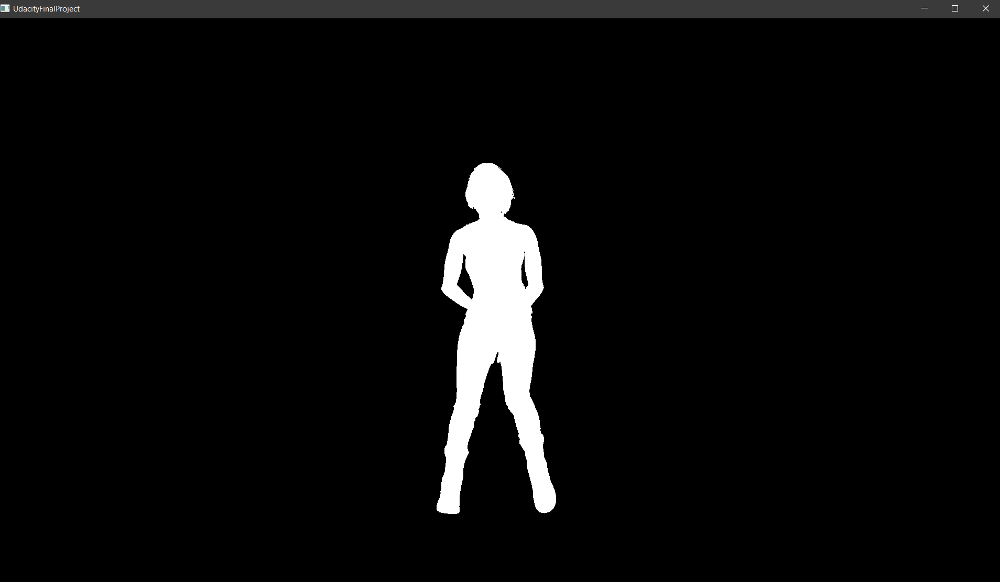
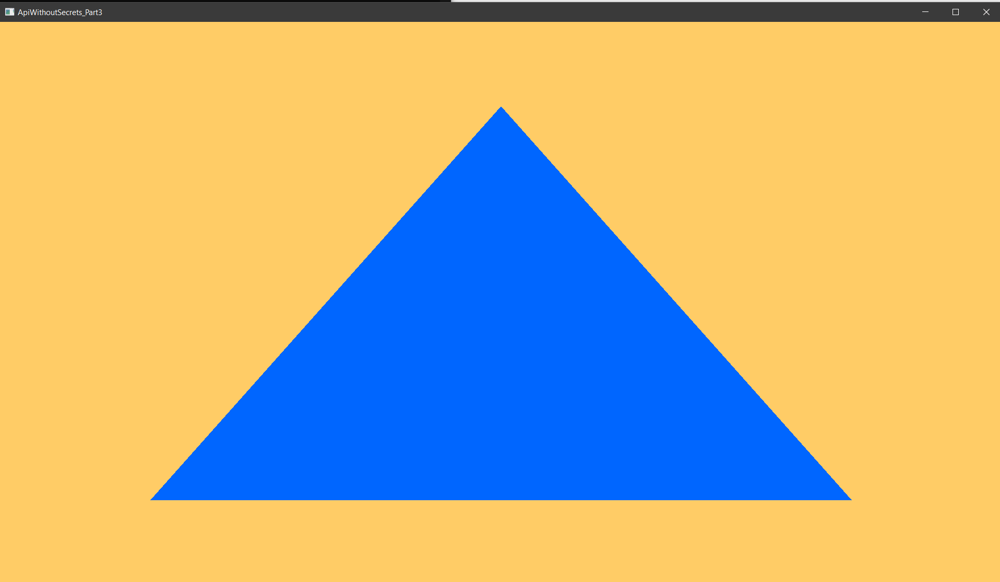
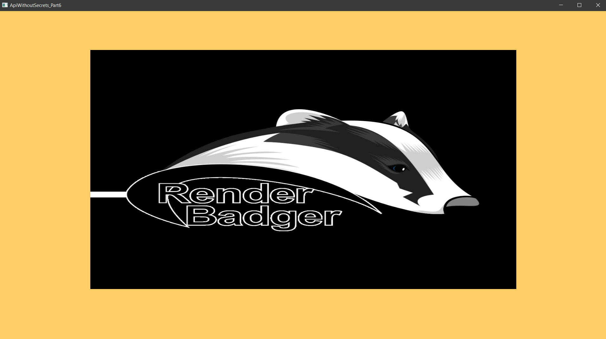

# BadgerEngineSandbox
Hugo Osornio

This Sandbox was initially created as the final project for Udacity's C++ Nano Degree Program.

## Rationale

The project's main intent is to be a Computer Graphics Vulkan Sandbox, where I can try different libraries, algorithms and tutorials.
For this project, I decided to start by porting Intel's API Without Secrets series of tutorials:
https://software.intel.com/content/www/us/en/develop/articles/api-without-secrets-introduction-to-vulkan-preface.html

For the final project, I reused most of the code from the Tutorials to load a glTF model.

## Third Party Libraries used

I used CMake and git submodules functionality, to fetch the following Third Party libraries:

### RapidVulkan:
https://github.com/Unarmed1000/RapidVulkan

Low level header only C++11 RAII wrapper classes for the Vulkan API. The RAII class design is heavily inspired by std::unique_ptr and is compatible with STL containers.

### tinygltf
https://github.com/syoyo/tinygltf

TinyGLTF is a header only C++11 glTF 2.0 https://github.com/KhronosGroup/glTF library.

### GLFW
https://github.com/glfw/glfw

GLFW is an Open Source, multi-platform library for OpenGL, OpenGL ES and Vulkan application development. It provides a simple, platform-independent API for creating windows, contexts and surfaces, reading input, handling events, etc.

### glm
https://github.com/g-truc/glm

OpenGL Mathematics (GLM) is a header only C++ mathematics library for graphics software based on the OpenGL Shading Language (GLSL) specifications.

## HOW TO BUILD
### Windows

You will need to have installed Visual Studio 2019 with C++ support.

You will also need the Vulkan SDK installed:
https://vulkan.lunarg.com/sdk/home#windows
I tested with 1.2.176

Once you have both requirements installed:

git clone --recursive https://github.com/HugoOsornio/BadgerEngineSandbox.git

mkdir build

cd build

cmake ..

This will download the Third Party libraries and create the Visual Studio project: BadgerEngineSandbox.sln
Open the Visual Studio Project and Set as startup project any of the samples explained below.

### Linux

For Linux you will need to install the Vulkan SDK:
https://vulkan.lunarg.com/sdk/home#linux
I tested with 1.2.176 on Ubuntu

Before trying to compile, you will need to source the setup-env.sh included with the SDK:
source <vulkan installation path>/setup-env.sh

Then you can fetch the code and build using the following commands:

git clone --recursive https://github.com/HugoOsornio/BadgerEngineSandbox.git

mkdir build

cd build

cmake ..

make

This will build the binaries for you to execute.

## Samples:

### [Udacity Final Project](./SelfContainedSamples/UdacityFinalProject)

In this chapter we load a glTF Model using Sacha Willems' glTF loader header; this loader uses in turn tinygltf to extract the data from the gltf file.

This code is inspired heavily from: https://github.com/SaschaWillems/Vulkan/blob/master/examples/gltfloading/gltfloading.cpp

  

### [ApiWithoutsecrets](./SelfContainedSamples/ApiWithoutSecrets.cpp)

This tutorial creates a Vulkan Instance, Physical Device and Device.
Ported from: https://software.intel.com/content/www/us/en/develop/articles/api-without-secrets-introduction-to-vulkan-part-1.html

### [ApiWithoutsecrets Part 2](./SelfContainedSamples/ApiWithoutSecrets_Part2.cpp)

In this lesson we create a window (using glfw) and then create a Vulkan Surface from that window.

This lesson introduces the concept of swapchains

Ported from: https://software.intel.com/content/www/us/en/develop/articles/api-without-secrets-introduction-to-vulkan-part-2.html

### [ApiWithoutsecrets Part 3](./SelfContainedSamples/ApiWithoutSecrets_Part3.cpp)

This chapter introduces the concept of Render Passes, Framebuffers and Graphics Pipelines.

A triangle is hardcoded into the pipeline

Ported from: https://software.intel.com/content/www/us/en/develop/articles/api-without-secrets-introduction-to-vulkan-part-3.html

### [ApiWithoutsecrets Part 4](./SelfContainedSamples/ApiWithoutSecrets_Part4.cpp)

This chapter introduces the concept of Vertex Attributes, Buffers, Images and Fences. 

2 Triangles are rendered and form a rectangle.

Ported from: https://software.intel.com/content/www/us/en/develop/articles/api-without-secrets-introduction-to-vulkan-part-4.html

### [ApiWithoutsecrets Part 5](./SelfContainedSamples/ApiWithoutSecrets_Part5.cpp)

In this chapter, the vertex buffer that was created on Chapter 4 is moved to a faster memory.

The concepts of staging buffers and buffer copies is introduced.

Ported from: https://software.intel.com/content/www/us/en/develop/articles/api-without-secrets-introduction-to-vulkan-part-5.html

### [ApiWithoutsecrets Part 6](./SelfContainedSamples/ApiWithoutSecrets_Part6.cpp)

In this chapter we load a texture and map it into the rectangle we rendered on previous chapters.

The concepts of Samplers, Descriptor Sets, Descriptor Set Layouts is introduced

Ported from: https://software.intel.com/content/www/us/en/develop/articles/api-without-secrets-introduction-to-vulkan-part-6.html

